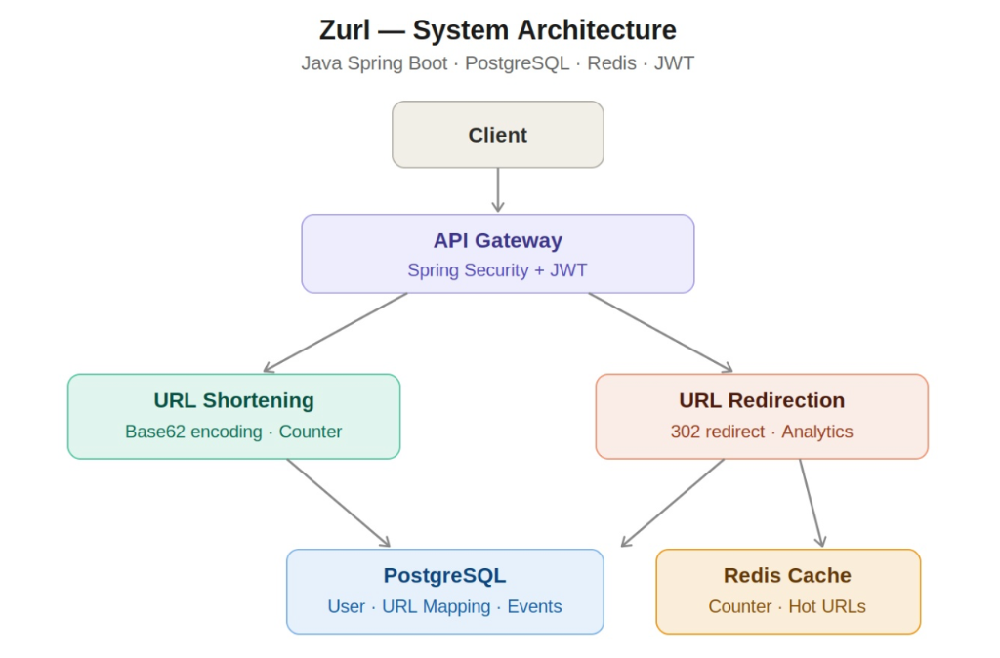

# Zurl — URL Shortener

> A full-stack, production-ready URL shortener with analytics, JWT authentication, and a modern dashboard.

🌐 **Live Demo:** [zurl-rho.vercel.app](https://zurl-rho.vercel.app)



---

## ✨ Features

- 🔗 **URL Shortening** — Turn long URLs into clean, shareable short links
- 📊 **Click Analytics** — Track total clicks and daily trends per link with charts
- 🔐 **JWT Authentication** — Secure user registration and login with Spring Security
- 📋 **Link Management** — Copy, delete, and search your links from a sleek dashboard
- ⏳ **Loading States** — Smooth skeleton loaders so there are no blank screens
- 🐳 **Dockerized** — Backend containerized and deployed via Docker on Render
- 🚀 **Production Deployed** — Frontend on Vercel, backend on Render, database on NeonDB (PostgreSQL)

---

## 💻 Tech Stack

### Backend
| Technology | Purpose |
|---|---|
| Java 17 | Core language |
| Spring Boot 4.0.4 | Application framework |
| Spring Security + JWT | Authentication & authorization |
| Spring Data JPA + Hibernate | ORM & database access |
| PostgreSQL (NeonDB) | Production database |
| Docker | Containerization |
| Render | Hosting |

### Frontend
| Technology | Purpose |
|---|---|
| React 19 | UI framework |
| Vite 8 | Build tool |
| Tailwind CSS v4 | Styling |
| Axios | HTTP client |
| Recharts | Data visualization |
| Lucide React | Icons |
| Vercel | Hosting |

---

## 🏗️ Architecture

The app is a classic Client-Server architecture:

- **Frontend (Vercel)**: React SPA with React Router. Communicates with the backend via REST APIs using Axios.
- **Backend (Render)**: Spring Boot REST API secured with JWT. Handles URL shortening, redirection, authentication, and analytics.
- **Database (NeonDB)**: Cloud-hosted PostgreSQL. Entities include `User`, `UrlMapping`, and `ClickEvent`.
- **CORS**: Configured in `WebSecurityConfig.java` to explicitly allow requests from the Vercel frontend.

---

## 📁 Folder Structure

```text
HakariLink/
├── HakariLink-frontend/           # React SPA
│   ├── src/
│   │   ├── components/            # Reusable UI (Loader, ShortenModal, etc.)
│   │   ├── context/               # AuthContext (JWT state management)
│   │   ├── layouts/               # DashboardLayout with sidebar
│   │   ├── lib/                   # Axios API client (api.js)
│   │   └── pages/                 # Dashboard, Links, Analytics, Auth pages
│   ├── vercel.json                # SPA routing config for Vercel
│   ├── .env                       # VITE_API_URL (not committed)
│   └── vite.config.js             # Vite bundler config
├── shorter/                       # Spring Boot Backend
│   ├── src/main/java/com/url/shorter/
│   │   ├── Controller/            # REST endpoints (Auth, URL Mapping)
│   │   ├── dtos/                  # Data Transfer Objects
│   │   ├── models/                # JPA Entities (User, UrlMapping, ClickEvent)
│   │   ├── repository/            # Spring Data JPA repositories
│   │   ├── security/              # JWT filter, WebSecurityConfig (CORS)
│   │   └── services/              # Business logic
│   ├── Dockerfile                 # Multi-stage Docker build
│   ├── .env.prod                  # Production DB credentials (not committed)
│   └── pom.xml                    # Maven dependencies
└── README.md
```

---

## 🚀 Local Development

### Prerequisites
- Java 17
- Node.js & npm
- Docker (optional, for running backend locally via container)
- A running PostgreSQL or MySQL database

### 1. Backend Setup
Create a `shorter/.env` file:
```env
DATABASE_URL=jdbc:mysql://localhost:3306/urlshortnerdb
DATABASE_USERNAME=root
DATABASE_PASSWORD=yourpassword
DATABASE_DRIVER=com.mysql.cj.jdbc.Driver
DATABASE_DIALECT=org.hibernate.dialect.MySQLDialect
JWT_SECRET=your_jwt_secret
```

Then run:
```bash
cd shorter
./mvnw spring-boot:run
```
Backend starts at `http://localhost:8080`.

### 2. Frontend Setup
Create a `HakariLink-frontend/.env` file:
```env
VITE_API_URL=http://localhost:8080
```

Then run:
```bash
cd HakariLink-frontend
npm install
npm run dev
```
Frontend starts at `http://localhost:5173`.

---

## 🐳 Docker (Backend)

```bash
# Build for production (linux/amd64 for cloud deployments)
docker build --platform linux/amd64 -t s8sankalp/shorter-backend .

# Run locally
docker run -p 8080:8080 shorter-backend

# Push to Docker Hub
docker push s8sankalp/shorter-backend
```

---

## 🔌 API Reference

### Public Endpoints
| Method | Endpoint | Description |
|--------|----------|-------------|
| `POST` | `/api/auth/public/register` | Register a new user |
| `POST` | `/api/auth/public/login` | Login, returns JWT token |
| `GET`  | `/{shortUrl}` | Redirect to original URL |

### Protected Endpoints (Requires `Authorization: Bearer <token>`)
| Method | Endpoint | Description |
|--------|----------|-------------|
| `POST` | `/api/urls/shorten` | Shorten a URL |
| `GET`  | `/api/urls/myurls` | Get all user's URLs |
| `DELETE` | `/api/urls/{id}` | Delete a URL |
| `GET`  | `/api/urls/totalClicks` | Get total click analytics |
| `GET`  | `/api/urls/{shortUrl}` | Get individual URL analytics |

---

## 🌍 Deployment

| Service | Platform | URL |
|---------|----------|-----|
| Frontend | Vercel | [zurl-rho.vercel.app](https://zurl-rho.vercel.app) |
| Backend | Render (Docker) | [shorter-backend.onrender.com](https://shorter-backend.onrender.com) |
| Database | NeonDB (PostgreSQL) | Cloud |

> ⚠️ Render free tier sleeps after inactivity. The first request may take ~30 seconds to wake the server.

---

## 📄 License

This project is open source and available under the [MIT License](LICENSE).

---

**Author**: [@s8sankalp](https://github.com/s8sankalp)
